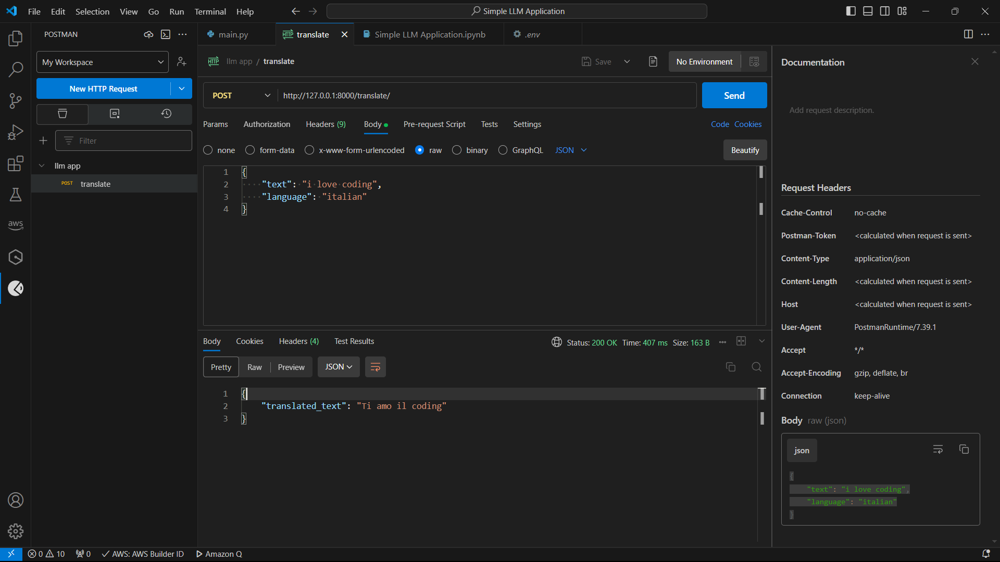

# LLM Translation API using Groq and LangChain

This is a simple Language Model (LLM) application that integrates **Groq** and **LangChain**. The application demonstrates the use of LangChain's `ChatPromptTemplate` for handling prompts and translates text using a Groq-based LLM model. Additionally, the project is built with **FastAPI** to create a scalable and easy-to-use REST API for translation.

## Features

- Utilizes **Groq** models with **LangChain** integration for language tasks.
- Demonstrates prompt template usage with `ChatPromptTemplate` from LangChain.
- Simple and fast API built using **FastAPI**.
- Supports testing using tools like **Postman**.
- 


## Requirements

- Python 3.8+
- FastAPI
- Uvicorn (ASGI server)
- LangChain with Groq integration
- Pydantic (for request body validation)
- Python dotenv (for environment variable management)

## Installation

1. **Clone the Repository**

   Clone the repository to your local machine:

   ```bash
   git clone https://github.com/your-username/llm-translation-api.git
   cd llm-translation-api
